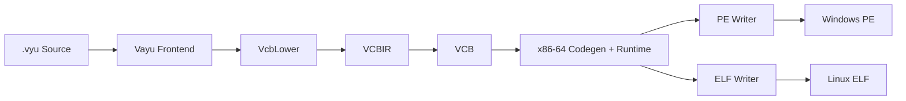

<div align="center">

<a href="https://vayu.gt.tc">
  
</a>

# Vayu

### Python simplicity. Native performance. Low-level control. AI-ready.

**A modern general-purpose programming language designed to combine simplicity, performance, portability, and powerful application development.**

<p>
  <a href="https://vayu.gt.tc"></a>
  <a href="https://vayu.gt.tc/faq"></a>
  <a href="docs/syntax.md"></a>
  <a href="https://vayu.gt.tc/speed"></a>
  <a href="https://marketplace.visualstudio.com/items?itemName=Fliczo.vayu"></a>
</p>

<p>
  
  
  
  
</p>

</div>

---

<div align="center">

<a href="https://vayu.gt.tc">
  
</a>

</div>

<div align="center">

## ⚡ Write Simple. Run Native. Control Everything.

**Vayu** brings together Python-inspired readability, native-performance goals, low-level control, modern typing, AI/ML ambitions, and application-development capabilities in one language.

**[🌐 Official Website](https://vayu.gt.tc) · [📖 Syntax](docs/syntax.md) · [🤖 AI & ML](docs/ai.md) · [📦 Packages](docs/package.md) · [🧭 Roadmap](docs/vision.md) · [📊 Benchmarks](https://vayu.gt.tc) · [🧩 VS Code](https://marketplace.visualstudio.com/items?itemName=Fliczo.vayu)**

</div>

---

## 🌐 Website

**[Visit the official Vayu website →](https://vayu.gt.tc)**

The website is the primary place for the latest Vayu information, roadmap, syntax references, benchmark information, and project updates. The Vayu logo and the banner links at the top of this README are clickable and lead directly to the website.

---

## 📊 Benchmarks

Vayu includes benchmarking as part of its development and performance evaluation process. Benchmarks are used to track compiler/runtime progress and compare representative workloads as the implementation evolves.

**[→ View the Vayu website and current benchmark information](https://vayu.gt.tc/)**

> Benchmark numbers are implementation- and environment-dependent. The website should be treated as the current source for published benchmark results rather than treating README numbers as permanent guarantees.

---

## 🧩 Editor Support

Vayu has editor tooling for `.vyu` source files through the VS Code extension and a native Visual Studio Community TextMate/VSIX extension.

**[🛒 Install Vayu from the VS Code Marketplace](https://marketplace.visualstudio.com/items?itemName=Fliczo.vayu)**

**Visual Studio Community:** build `vscommunity-vayu-Extention` with its `build.ps1` script and install the generated `vayu-lang-support-1.0.0.vsix`.

**[⚡ Install directly in VS Code](vscode:extension/Fliczo.vayu)**

The extension provides editor-side integration for Vayu, including:

- `.vyu` language support
- Syntax highlighting
- Vayu Language Server integration
- Diagnostics
- Hover information
- Go to definition
- Completion
- References
- Rename support
- Signature help
- Formatter integration
- Linter integration
- Vayu configuration support

The compiler repository also contains the standalone `vls`, `vfmt`, and `vlint` tooling used by the extension.

---

## What is Vayu?

**Vayu** is a next-generation programming language designed to combine the best ideas from:

- 🐍 **Python** — simple, readable syntax and a powerful ecosystem
- ⚡ **C++** — native performance and low-level control
- ☕ **Java** — portability and large-scale application development
- 🎯 **C#** — modern application and GUI development

Vayu aims to provide these capabilities without forcing developers to switch between multiple languages for different types of software.

> **Write simple. Run native. Control everything.**

---

## Core Philosophy

Vayu is built around a simple idea:

> **Programming should be easy to learn, powerful enough for professionals, and fast enough for demanding software.**

The language focuses on:

- Clean, Python-inspired syntax
- Native compiled execution
- Strong static typing with type inference
- Optional explicit type annotations
- Modern memory and resource management
- High-level APIs with low-level access when required
- AI/ML and scientific computing
- GUI and application development
- Game and graphics development
- Systems and performance-oriented programming
- Cross-platform development
- C/C++ interoperability
- Python ecosystem interoperability
- Future Java and .NET interoperability

---

# Vayu vs Other Languages

| Capability | Python | C++ | Java | C# | **Vayu** |
|---|---:|---:|---:|---:|---:|
| Beginner-friendly syntax | ⭐⭐⭐⭐⭐ | ⭐⭐ | ⭐⭐⭐ | ⭐⭐⭐⭐ | ⭐⭐⭐⭐⭐ |
| Native performance | ⭐⭐ | ⭐⭐⭐⭐⭐ | ⭐⭐⭐⭐ | ⭐⭐⭐⭐ | ⭐⭐⭐⭐⭐ |
| Low-level control | ⭐⭐ | ⭐⭐⭐⭐⭐ | ⭐⭐ | ⭐⭐⭐ | ⭐⭐⭐⭐⭐ |
| Type inference | ⭐⭐⭐ | ⭐⭐⭐⭐ | ⭐⭐⭐⭐ | ⭐⭐⭐⭐⭐ | ⭐⭐⭐⭐⭐ |
| Memory control | ⭐⭐ | ⭐⭐⭐⭐⭐ | ⭐⭐ | ⭐⭐⭐ | ⭐⭐⭐⭐⭐ |
| AI/ML ecosystem | ⭐⭐⭐⭐⭐ | ⭐⭐⭐ | ⭐⭐⭐ | ⭐⭐⭐ | ⭐⭐⭐⭐⭐ |
| GUI/application development | ⭐⭐⭐ | ⭐⭐⭐⭐ | ⭐⭐⭐⭐ | ⭐⭐⭐⭐⭐ | ⭐⭐⭐⭐⭐ |
| Game development | ⭐⭐ | ⭐⭐⭐⭐⭐ | ⭐⭐⭐ | ⭐⭐⭐⭐⭐ | ⭐⭐⭐⭐⭐ |
| Cross-platform | ⭐⭐⭐⭐⭐ | ⭐⭐⭐⭐ | ⭐⭐⭐⭐⭐ | ⭐⭐⭐⭐ | ⭐⭐⭐⭐⭐ |
| Simplicity + performance | ⭐⭐ | ⭐⭐⭐ | ⭐⭐⭐ | ⭐⭐⭐⭐ | ⭐⭐⭐⭐⭐ |

**These ratings represent Vayu's design goals, not a claim that it currently has the maturity or ecosystem size of established languages.**

---

# Key Features

## 🧠 Simple Syntax

Vayu uses a clean, indentation-friendly syntax designed to remain readable while supporting serious software development.

The complete syntax and currently implemented features are documented separately:

**[→ Read the Vayu Syntax Reference](docs/syntax.md)**

---

## ⚡ Native Performance

Vayu is designed as a **compiled native language**.

The goal is to provide:

- Native machine-code execution
- Compiler optimizations
- Efficient memory usage
- Hardware-level control
- Low runtime overhead
- High-performance applications

---

## 🔄 Vayu + VCB Data Flow

Vayu owns the language frontend and lowers supported programs into VCBIR. VCB parses VCBIR, generates x86-64 machine code, emits the required runtime, and writes the final PE or ELF executable.



**[→ Full Vayu + VCB Data Flow](docs/data-flow.md)**

---

## 🧩 Modern Type System

Vayu combines:

- Static typing
- Type inference
- Optional type annotations
- Generic types
- Structs
- Classes
- Inheritance
- Function types
- Modern error handling

---

## 🧠 Memory & Resource Control

Vayu is designed to provide both convenience and control.

The language aims to support:

- Automatic management for common cases
- Deterministic resource handling
- Ownership-oriented programming
- Smart pointers
- Explicit memory operations
- Unsafe/low-level programming when required

Planned smart-pointer concepts include:

```text
unique<T>
shared<T>
weak<T>
```

---

# 🤖 AI & Machine Learning

AI is a major direction of Vayu.

The ecosystem is planned to support:

- Machine learning
- Deep learning
- Neural networks
- Tensor operations
- Data processing
- Computer vision
- GPU acceleration
- CUDA
- ONNX
- Python AI ecosystem interoperability

Target compatibility includes technologies such as NumPy, PyTorch, TensorFlow, OpenCV, ONNX, CUDA, and ROCm.

**[→ Read the Vayu AI & ML Documentation](docs/ai.md)**

---

# 📦 Package Ecosystem

Vayu is designed around a dedicated package ecosystem.

The package manager is planned around:

```text
nva install <package>
```

The ecosystem is intended to provide:

- Package installation
- Dependency management
- Version management
- Project configuration
- Lock files
- Package publishing
- Build integration
- Native libraries
- AI/ML packages
- GUI libraries
- Game-development libraries

The package documentation contains the detailed package-system specification:

**[→ Read the Vayu Package Documentation](docs/package.md)**

> Package-manager naming and implementation may evolve as the ecosystem matures.

---

# 🖥️ Application Development

Vayu is designed to cover more than command-line programs.

### GUI

- Desktop applications
- Modern user interfaces
- Native application APIs
- Cross-platform GUI development

### Games

- Game logic
- Graphics
- Input
- Audio
- Physics
- Rendering
- OpenGL
- Vulkan
- DirectX

### Systems

- Native applications
- System utilities
- Hardware-oriented software
- High-performance services
- Networking

### Scientific & Data

- Numerical computing
- Data processing
- Scientific applications
- Visualization
- AI/ML workflows

---

# 🔗 Interoperability

Vayu is intended to work with existing ecosystems instead of isolating developers.

### C / C++

Native interoperability is a major part of Vayu's systems-programming direction, allowing existing native libraries and platform APIs to be used.

### Python

Vayu is designed to interact with the Python ecosystem through runtime/FFI interoperability where appropriate, especially for AI, ML, data science, and scientific computing.

### Java

Future interoperability is intended through JVM/JNI-based integration.

### C#

Future interoperability is intended through .NET integration.

---

# 🌍 Cross-Platform

Vayu is designed to become a cross-platform language.

Target platforms include:

- Windows
- Linux
- macOS
- Android
- Other platforms as the compiler and ecosystem mature

---

# 📁 Source Format

Vayu source files use:

```text
.vyu
```

Examples:

```text
hello.vyu
main.vyu
game.vyu
ai.vyu
```

The official language name is **Vayu** and the official source extension is **`.vyu`**.

---

# 📚 Documentation

| Document | Purpose |
|---|---|
| [`docs/syntax.md`](docs/syntax.md) | Complete language syntax and implemented features |
| [`docs/package.md`](docs/package.md) | Package manager and ecosystem |
| [`docs/ai.md`](docs/ai.md) | AI/ML direction and ecosystem |
| [`docs/vision.md`](docs/vision.md) | Long-term vision, phased roadmap, and current development status |
| [`CODE OF CONDUCT.md`](CODE%20OF%20CONDUCT.md) | Community standards and contributor conduct |
| [`REPORTING_GUIDELINES.md`](REPORTING_GUIDELINES.md) | Guidelines for reporting and handling unacceptable behavior |

---

# 🚀 Long-Term Vision

Vayu is intended to grow into a complete development ecosystem.

The long-term vision includes:

- Mature native compiler
- Advanced optimizer
- Self-hosting compiler
- Standard library
- Package ecosystem
- IDE/LSP support
- VS Code extension, formatter and linter
- Debugging tools
- AI/ML stack
- GUI framework
- Game-development stack
- Graphics APIs
- Native interoperability
- Cross-platform tooling
- Modern concurrency
- Metaprogramming
- Professional developer tooling

**[→ Read the Vayu Vision](docs/vision.md)**

---

# 👨‍💻 Independent Development

Vayu is currently being developed by **one independent developer**.

There is:

- No company behind the project
- No corporate development team
- No revenue model
- No large development budget
- No large engineering organization

Vayu is being developed as an independent project driven by experimentation, learning, engineering, and the goal of creating a language that combines ideas from several ecosystems.

> **Small team. Big vision.**

---

# 🤝 Contributing

Contributions, ideas, bug reports, documentation improvements, and language-design discussions are welcome.

Before contributing, please read **[CODE OF CONDUCT.md](CODE%20OF%20CONDUCT.md)** and follow the project's community standards.

---

# ✅ Advantages

- Python-inspired readability
- Native compiled execution
- Low-level capabilities
- Static typing with inference
- Modern memory-management direction
- AI/ML-focused ecosystem
- GUI development goals
- Game-development goals
- Systems-programming capabilities
- Cross-platform ambitions
- C/C++ interoperability
- Python ecosystem interoperability
- Beginner-friendly philosophy
- Professional-development ambitions
- One unified ecosystem instead of many disconnected languages

---

# ⚠️ Current Limitations

Vayu is still an evolving language.

Important limitations include:

- Small ecosystem
- Limited third-party packages
- Young compiler
- Developing tooling
- IDE support is currently centered on Visual Studio Code
- Advanced IDE integrations and debugger tooling are still evolving
- Limited documentation compared with established languages
- Smaller community
- Many planned features are not yet mature
- Compatibility layers are still evolving
- Performance and stability will improve as the compiler matures

Vayu should therefore be considered an **early-stage independent language project**, not a replacement for mature languages yet.

---

# 🎯 Who Is Vayu For?

Vayu is designed for developers who want to work across multiple areas without constantly changing languages.

Potential users include:

- Beginners learning programming
- Application developers
- Systems programmers
- Game developers
- AI/ML developers
- Scientific programmers
- Tool developers
- Desktop application developers
- Performance-oriented developers
- Developers coming from Python
- Developers coming from C++
- Developers interested in language design

---

# 🧭 Design Principles

### 1. Simplicity
Common tasks should require minimal unnecessary code.

### 2. Performance
High-level syntax should not automatically mean low performance.

### 3. Control
Developers should be able to access lower-level capabilities when needed.

### 4. Interoperability
Existing ecosystems should be usable rather than discarded.

### 5. Portability
Software should be able to move across platforms with minimal changes.

### 6. Practicality
Features should solve real development problems rather than exist only because they are technically possible.

### 7. One Ecosystem
The long-term goal is to make Vayu useful for everything from small programs and applications to games, AI systems, and native software.

---

# 📊 Current Status

Vayu is an **early-stage independent programming language project** with an expanding compiler, runtime, tooling, FFI layer, Python/CPython interoperability, and native-backend work.

**Phase 23 has been completed.** Phases 19 and 20 established the native window/event/widget and 2D graphics foundations; Phase 21 completed the software raster and 3D pipeline; Phase 22 established the package-ecosystem direction and continued runtime/UI work; Phase 23 completed the single-binary native-toolchain direction toward VCB. The C++ `vayuc` compiler remains the bootstrap/reference compiler while the project continues toward self-hosting.

**Phase 27 Parts 1–17 are complete. The WDAC structural fix is done but remains intermittent for some binaries. Signing is removed from the roadmap because the object + external-link path replaces that dependency. Phase 25 is intentionally skipped for now. Phase 26 Part 1 and Part 2 are complete. VCB is the active native backend for Vayu, with Windows PE and Linux ELF output, runtime emission, executable-format handling, and target validation.**

Current implemented areas include:

- indentation-based `.vyu` syntax
- static type checking and type inference
- functions, recursion, lambdas, closures and higher-order functions
- lists, maps, tuples and sets, including slicing
- structs, classes, inheritance, overriding and `super()`
- exceptions and modules
- `const`, `enum`, static members and visibility modifiers
- `match`, `with`, `defer`, `yield` and generators
- bitwise operators and compound assignment
- ownership/reference types such as `unique<T>`, `shared<T>`, and `weak<T>`
- raw pointers, references, pointer arithmetic, `malloc()` and `free()`
- C FFI, function pointers, external-library linking and supported struct-by-value FFI
- runtime modules including math, filesystem/OS, regex, threading, networking, crypto, random, time and JSON
- native floating-point values, mixed int/float arithmetic, comparisons and conversions
- native `math.*` operations, float lists and float-valued maps
- VCB-backed native compilation and executable emission
- native CPython loading and expanded Python value/call interoperability

### Current Development Direction

**Current development — VCB-backed native toolchain**

Vayu's native compiler now lowers supported Vayu programs into VCB IR and uses VCB for native code generation and executable emission. Windows native output is backed by VCB's PE path, and the Linux path is covered by VCB's ELF target and the Phase 27 ELF matrix.

**Phase 27 Parts 1–16 — Done**

The completed work covers the ELF writer and Linux runtime subset, Linux heap/list/map/string runtime, PE correctness and padding, relocations and ASLR, `.pdata` / `.xdata`, kernel32 heap APIs, Linux `vayu_print_float`, PE layout corrections, WDAC diagnosis and signing tools, shared x86-64 emitter extraction, the 11-program PE matrix, runtime `.pdata` / `.xdata` coverage, and the Linux ELF matrix.

**Phase 27 Parts 1–16 — Done.**

**Phase 27 Parts 1–17 — Done. The WDAC structural fix is complete, while the object + external-linker path becomes the next major backend transition.

**Phase 18 — Vayu developer tooling**

The current development track focuses on making Vayu practical to use inside a modern editor and development workflow. The repository now contains the Vayu Language Server, formatter, linter, and VS Code extension, alongside the existing compiler/runtime infrastructure.

**Phase 17 — Vayu self-hosting / compiler bootstrap**

The existing C++ `vayuc` remains the bootstrap/reference compiler while Vayu itself is developed toward feature parity. The long-term objective is for Vayu to compile its own compiler and eventually allow the C++ bootstrap implementation to be dropped.

### Vayu Roadmap

| Phase / Item | Status | Scope |
|---|---|---|
| 27 Parts 1-17 | done | ELF writer, Linux runtime, PE correctness, validator |
| WDAC structural fix | done | `.rsrc`, rich header, 32 KB minimum image |
| Signing | removed | Not needed once obj+linker path lands |
| Tools | ready | `VCB\\tools\\`: `lld-link.exe`, `ld.lld.exe` (LLVM 22.1.3), `kernel32.lib`, LLVM inspection tools |
| 28.0 | prep, one patch remaining | `run_all.ps1` line 214 last-line stderr |
| — | waiting | Awaiting your next prompt |
| 28.1 | queued | COFF `.obj` emitter + `vcb emit-obj` |
| 28.2 | queued | ELF `.o` emitter |
| 28.3 | queued | `vcb link` - `lld-link` / `ld.lld` dispatch |
| 28.4 | queued | `vayuc --native` external-link default |
| 28.5 | queued | VcbLower builtin guard |
| 29 | queued | MAC policy templates |
| 30 | queued | Small VcbLower additions |
| 31 | queued | Tuples, sets, slicing |
| 32 | queued | Classes, structs, inheritance |
| 33 | queued | Lambdas, closures |
| 34 | queued | Exceptions |
| 35 | queued | Pointers, FFI |
| 36 | queued | Modules and stdlib |
| 37 | queued | `.text` size limit removal |
| 38 | queued | Self-hosting on VCB IR |
| 39 | queued | Full benchmark suite |
| 40 | queued | Version cut |

## DeepSeek

<div align="center">
<a href="https://www.deepseek.com/">

</a>
</div>

**DeepSeek played the larger supporting role in the development process.**

It provided substantial assistance with:

- Programming
- Compiler development
- Architecture discussions
- Debugging
- Language design
- Implementation planning
- Turning concepts into practical code
- Exploring solutions during development

**Thank you, DeepSeek, for being a major part of the Vayu journey. ❤️**

---

## ChatGPT

<div align="center">

<a href="https://chatgpt.com/">

</a>

</div>

**ChatGPT provided a smaller supporting role**, mainly helping with:

- Confirmation
- Design discussions
- Brainstorming
- Documentation refinement
- Reviewing ideas
- Clarifying technical concepts

**Thank you, ChatGPT, for being part of the Vayu journey. ❤️**

---

> **Acknowledgement of these tools does not imply sponsorship, partnership, endorsement, or official affiliation with Vayu or its developer.**

---

# 💭 Final Words

Vayu is an ambitious independent experiment:

**What if the simplicity of Python, the performance and control of C++, the portability of Java, and the application-development strengths of C# could move toward one unified language?**

Vayu is an attempt to explore that idea.

It is still young.

It is still evolving.

And there is a long way to go.

But the goal is simple:

> **Make programming simpler without giving up power.**

---

<div align="center">

### Vayu

**Write simple. Run native. Control everything.**

Made independently with ❤️, code, experimentation, and a lot of debugging.

**[🌐 vayu.gt.tc](https://vayu.gt.tc)**

</div>
