# Vayu + VCB Data Flow

This document describes the native compilation path currently implemented across the Vayu and VCB repositories.

## Complete Native Flow

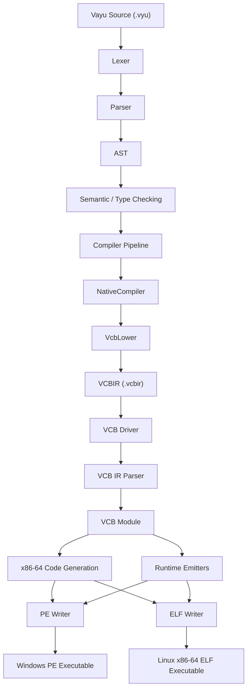

## Repository Boundary

Vayu owns the language frontend and the Vayu-to-VCBIR lowering layer. VCB owns the backend that parses VCBIR, generates x86-64 machine code, emits runtime helpers, and writes PE or ELF images.

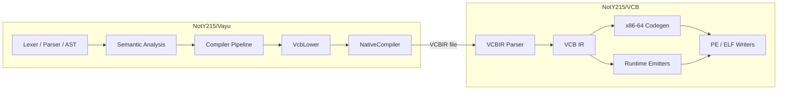

## Vayu Frontend to VCB

The native compiler lowers the already parsed Vayu program into VCBIR, writes a temporary .vcbir file, and invokes VCB to build the final executable.

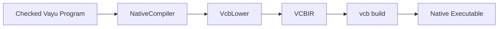

The current native implementation uses `compiler/native/NativeCompiler.cpp` and `compiler/native/VcbLower.cpp`.

NativeCompiler locates VCB, writes the generated IR, invokes vcb build, and can run the resulting executable. The VAYU_VCB environment variable can override the VCB executable path.

## VcbLower

VcbLower converts supported Vayu expressions, functions, control flow, collections, strings, and runtime operations into VCBIR.

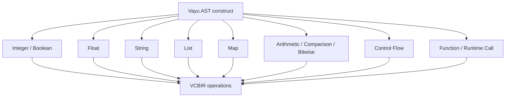

Collection operations use VCB runtime functions such as `vayu_list_new`, `vayu_list_push`, `vayu_map_new`, and `vayu_map_put`.

## VCB Backend

VCB parses the .vcbir input into its internal module representation and then performs native code generation.

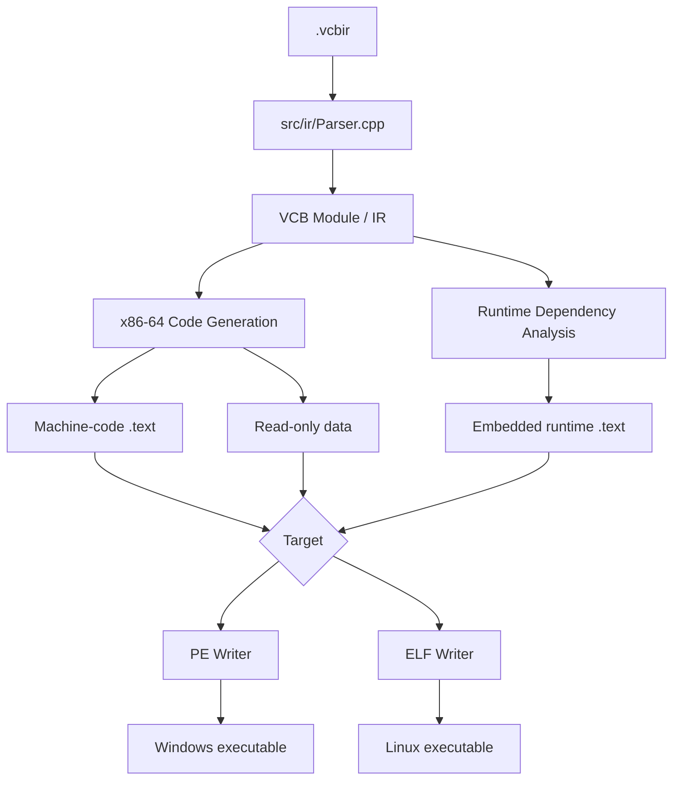

The backend currently handles integer and floating-point operations, comparisons, loads/stores, stack allocation, branches, jumps, phi handling, calls, returns, string constants, runtime dependency emission, and target-specific executable writing.

## Runtime Flow

VCB embeds required runtime helpers directly into the generated native image. Runtime emission is demand-driven.

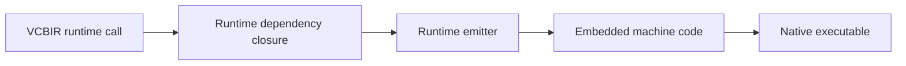

Current runtime areas include printing, process exit, Linux syscall support, Linux brk allocation, lists, maps, string operations, collection printing, and Windows runtime/import support.

## String Flow

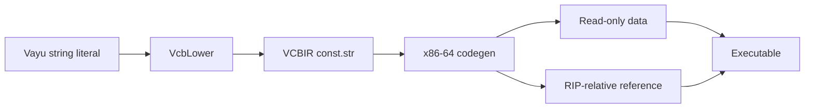

## Collection Flow

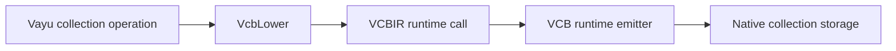

## Control-Flow Flow

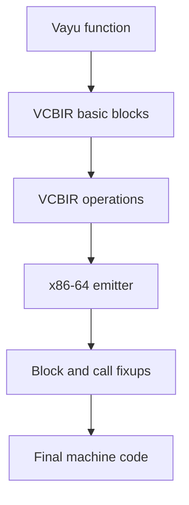

Branches and jumps are represented in VCBIR first. The x86-64 emitter resolves relative offsets after code layout.

## Windows PE Path

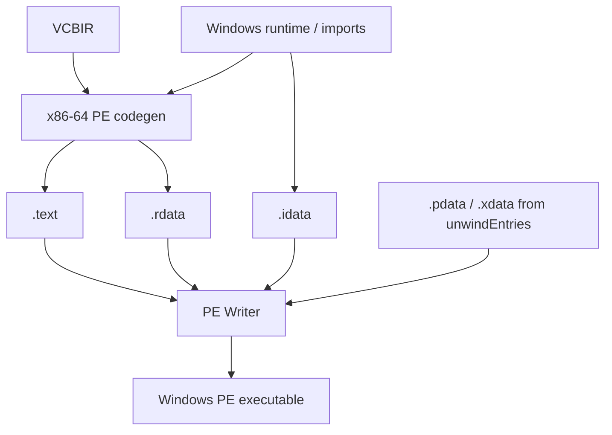

The vcb headers command inspects PE structure and reports validation errors and warnings.

## Linux ELF Path

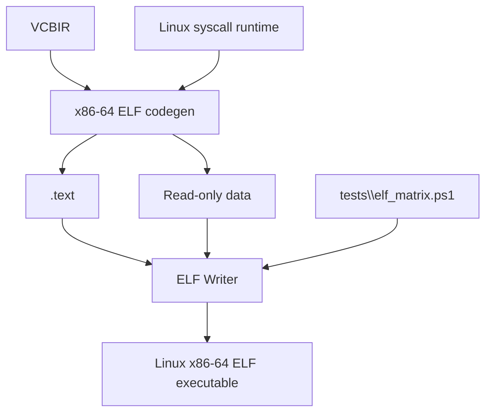

The Linux entry code calls main, transfers its result to the Linux exit-code register, and invokes the Linux exit syscall. The current ELF matrix validates the generated Linux path; Linux `.eh_frame` support is the next unwind-related target.

## Inspection and Debug Flow

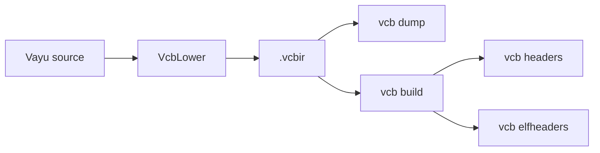

This boundary makes it possible to distinguish Vayu lowering problems from VCB backend problems.

## Current Architecture

```text
Vayu
  Lexer -> Parser -> AST -> Semantic Analysis -> VcbLower
                                                |
                                                v
                                             VCBIR
                                                |
                                                v
VCB
  Parser -> IR -> x86-64 Codegen + Runtime -> PE / ELF Writer
```

The .vcbir representation is the contract between the two repositories: Vayu owns language semantics and lowering, while VCB owns native backend generation and executable writing.


## Phase 27 Backend Status

Phase 27 Parts 1–16 are complete. The current VCB backend includes:

- Windows PE emission and validation
- Linux x86-64 ELF emission and the ELF test matrix
- Runtime `.pdata` / `.xdata` coverage through the shared unwind-entry collection
- `X64Common.hpp` as the shared x86-64 emitter layer
- VCB signing and verification commands
- WDAC supplemental-policy tooling
- Linux runtime support for syscalls, heap allocation, lists, maps, strings, and float printing

The next milestone is Phase 27 Part 17:

```text
Import construction
      ↓
move into writePe
      ↓
remove kIdataRva hardcode

Linux unwind path
      ↓
add .eh_frame
```
